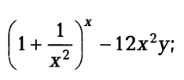

# Практическая работа "Линейные программы"

## Задание №1 (ex_03_01.cpp)
Вычислить значение по следующим формулам при действительных значениях всех переменных

## Задание №2 (ex_03_02.cpp)
Вычислить значение по следующим формулам при действительных значениях всех переменных

## Задание №3 (ex_03_03.cpp)
Найти произведение цифр заданного четырехзначного числа.

## Задание №4 (ex_03_04.cpp)
Вычислить расстояние между двумя точками с заданными координатами (x1,y1) и (х2, у2).

## Задание №5 (ex_03_05.cpp)
Дана длина ребра куба. Найти площади грани, полной поверхности и объем этого куба.

## Задание №6 (ex_03_06.cpp)
Перевести радианную меру угла в градусы, минуты и секунды. Решить обратную задачу.

## Задание №7 (ex_03_07.cpp)
Окружность вписана в квадрат с заданной площадью. Найти площадь квадрата, вписанного в эту окружность.

