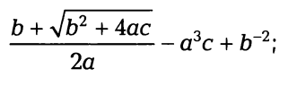
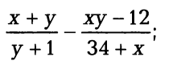

# Задания для самостоятельного выполнения
> Минимально необходимо количество (на 3):**Одно** из заданий 1 или 2 и **два** из заданий 3-5

## Задание №1 (task_03_01.cpp)
Вычислить значение по следующим формулам при действительных значениях всех переменных

## Задание №2 (task_03_02.cpp)
Вычислить значение по следующим формулам при действительных значениях всех переменных

## Задание №3 (task_03_03.cpp)
Дана длина стороны равностороннего треугольника. 
Найти площадь этого треугольника, его высоту, радиусы вписанной и описанной окружностей.

## Задание №4 (task_03_04.cpp)
Три резистора Rl, R2, R3 соединены параллельно. Найти сопротивление соединения. 
Решить обратную задачу: по известному общему сопротивлению соединения и двум из трех сопротивлений резисторов, найти третье.

## Задание №5 (task_03_05.cpp)
Дано натуральное число Т, представляющее собой длительность прошедшего времени в секундах. Вывести это значение длительности в часах, минутах и секундах в следующей форме: НН ч ММ мин SS с.
