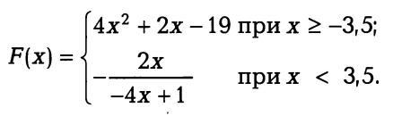

# Практическая работа "Ветвление"

## Задание №1 (ex_04_01.cpp)
Даны три действительных числа. Возвести в квадрат неотрицательные из этих чисел и в четвертую степень — отрицательные. 
Процесс организовать с использованием функции **pow_number**

## Задание №2 (ex_04_02.cpp)
Даны целые числа t, n. Если эти числа не равны, заменить меньшее из них большим исходных числом, а если равны, то заменить оба исходных числа нулями.  

## Задание №3 (ex_04_03.cpp)
Определить, пройдет ли график функции **y=ax^2+bx+c** через заданную точку с координатами (m,n). 
Процесс организовать с использованием функции **check_point**   
Функция должна вернуть **1** если точка принадлежит графику, **0** - в противном случае

## Задание №4 (ex_04_04.cpp)
Дан круг с радиусом **R**. Определить, поместится ли правильный треугольник со стороной **a** в этом круге. 
Процесс организовать с использованием функции **check_triangle**   
Функция должна вернуть **1** если треугольник помещается, **0** - в противном случае

## Задание №5 (ex_04_05.cpp)
В небоскребе **N** этажей и всего один подъезд. На каждом этаже по три квартиры.
Лифт может останавливаться только на нечетных этажах. Человек входит в кабину лифта и набирает номер необходимой ему квартиры **М**. 
Определить, на какой этаж лифт должен доставить пассажира? 
Процесс организовать с использованием функции **find_floor**   
Функция должна вернуть номер этажа

## Задание №6 (ex_04_06.cpp)
Два прямоугольника, расположенные в первом квадранте, со сторонами, параллельными осям координат, заданы координатами своих левого верхнего и правого нижнего углов. Для первого прямоугольника это точки с координатами (х1,y1) и (х2, 0), для второго — (х3, у3), (х4, 0). Определить, пересекаются ли данные прямоугольники, и вычислить площадь их общей части, если они пересекаются. 
Функция **isect_rect** должна вернуть площадь общей части или **0**, если прямоугольники не пересекаются.

## Задание №7 (ex_04_07.cpp)
Дана точка А(х, у). Определить, принадлежит ли она треугольнику с вершинами, имеющими координаты (x1,y1), (x2,y2), (х3, y3)
Процесс организовать с использованием функции **check_point**   
Функция должна вернуть **1** если точка принадлежит треугольнику, **0** - в противном случае

## Задание №8 (ex_04_08.cpp)
Вычислить значение функции. Процесс организовать с использованием функции **func_calc** 

## Задание №9 (ex_04_09.cpp)
Составить программу, которая по введенному номеру дня недели выводит его название.

## Задание №10 (ex_04_10.cpp)

Пусть элементами прямоугольного равнобедренного треугольника являются: 1 — катет а; 2 — гипотенуза b; 3 — высота,опущенная из вершины прямого угла на гипотенузу h; 
4 — площадь S. По заданным номеру и значению соответствующего элемента вычислить значения всех остальных элементов треугольника.
