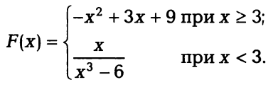

# Задания для самостоятельного выполнения

## Логические выражения

Составить программы, печатающие значение **True**, если следующие указанные высказывания являются истинными, и значение
**False** — в противном случае.

### task_04_01.cpp
Квадрат заданного трехзначного числа равен кубу суммы цифр этого числа 
Процесс организовать с помощью функции **check_cub(int num)**. 
Функции передается число. Возвращает 1 если утверждение истино, 0 - в противном случае 

### task_04_02.cpp
Даны три стороны одного треугольника и три стороны другого. 
Эти треугольники равновеликие, т.е. имеют равные площади. 
Процесс организовать с помощью функции **check_tr(int a1,int b1,int c1,int a2,int b2,int c2)**.  
Функция принимает три стороны одного и три стороны другого треугольника и возвращает 1 если утверждение истино, 0 - в противном случае 

### task_04_03.cpp

Координаты левой верхней и правой нижней вершин прямоугольника (x1, y1) и (х2, у2).
Точка А(х,у) принадлежит прямоугольнику. 
Процесс организовать с помощью функции **check_point(int x1,int y1,int x2,int y2, int x, int y)** 
Функция принимает координаты вершин прямоугольника и точки, и возвращает 1 если точка принадлежит прямоугольнику, 0 - в противном случае 

-------------------

## Текстовые задачи

### task_04_04.cpp
Услуги телефонной сети оплачиваются по следующему правилу: за разговоры до **А** минут в месяц платится **B** рублей, а разговоры сверх установленной нормы оплачиваются из расчета **С** рублей за минуту. Вычислить плату за пользование телефоном для введенного времени **M** разговоров за месяц. 
Процесс организовать с помощью функции **calc_pay(int A,int B,int C,int M)** 
Функция возвращает сумму оплаты

### task_04_05.cpp
Проанализировать возраст человека, чтобы отнести к одной из четырех групп: дошкольник, ученик, работник, пенсионер. Возраст вводится с клавиатуры.

### task_04_06.cpp
Два круга заданы координатами своих центров и радиусами — соответственно (x1, y1), r1 и (х2, у2), r2. Определить, пересекаются ли эти круги. 
Процесс организовать с помощью функции **check_circle(int x1,int y1,int r1, int x2,y2,int r2)**.  
Функция принимает координаты центров и радиусы кругов и возвращает 1 если круги пересекаются, 0 - в противном случае 

---------------

## Значения функций

### task_04_07.cpp
Вычислить значение функции:

Значение функции вычисляется с помощью функции 

------------------------------
## Оператор выбора

### task_04_08.cpp
Имеется пронумерованный список деталей: 1 — шуруп, 2 — гайка, 3 — винт, 4 — гвоздь, 5 — болт. По номеру детали вывести на экран ее название.
