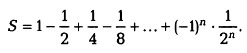
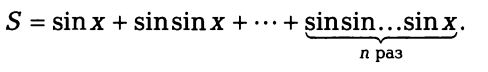
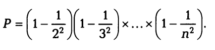

# Практическая работа "Цикл с параметром"

### Пример №1 (ex_05_01.cpp)
Начав тренировки, спортсмен в первый день пробежал 10 км. Каждый день он увеличивал дневную норму на 10 % от нормы предыдущего дня.
Определить, какой суммарный путь пробежит спортсмен за n дней. 
Процесс организовать с помощью функции **sum_dist**  
Функция **sum_dist** принимает в качестве аргумента количество дней тренировок **n** и возвращает суммарный путь

### Пример №2 (ex_05_02.cpp)
Покупатель должен заплатить в кассу сумму n рублей. У него имеются купюры достоинством 10, 50, 100, 500, 1000 и 5000 р. 
Определить, сколько купюр разного достоинства отдаст покупатель, если начнет платить с самых крупных. 

### Пример №3 (ex_05_03.cpp)
Проверить утверждение о том, что результатами вычислений по формуле х^2 + х + 17 при 0 <= х <= 15 являются простые числа. Все результаты вывести на экран

### Пример №4 (ex_05_04.cpp)
Найти наибольшее значение отношения трехзначного числа к сумме его цифр. 
Процесс организовать с помощью функции **check_number**  
Функция принимает в качестве аргумента трехзначное **n** и возвращает отношение числа к сумме его цифр

### Пример №5 (ex_05_05.cpp)
Вычислить количество точек с целочисленными координатами, находящихся в круге с радиусом R > 0 c центром в точке с координатами x,y.
Процесс организовать с помощью функции **calc_points**  
Функция принимает в качестве аргумента координаты центра и радиус круга и возвращает количество точек

## Суммы и произведения чиcловых последовательностей

### Пример №6 (ex_05_06.cpp)
Дано натуральное число N. Вычислить:

Вычисление выполнить с помощью функции **calc_sum(n)** 
Функция принимает в качестве аргумента число n

### Пример №7 (ex_05_07.cpp)
Даны натуральное число n и действительное число х. Вычислить:

Вычисление выполнить с помощью функции **calc_sum(int x, int n)** 
Функция принимает в качестве аргумента числа **x** и **n**

### Пример №8 (ex_05_08.cpp)
Дано натуральное число n > 2. Вычислить:

Вычисление выполнить с помощью функции **calc_mult(n)** 
Функция принимает в качестве аргумента число n

### Пример №9 (ex_04_05.cpp)
Найти сумму всех n-значных чисел, кратных k (1 <= n <= 4). 
Вычисление выполнить с помощью функции **calc_sum_digits(n)** 
Функция принимает в качестве аргумента число n

### Пример №10 (ex_05_10.cpp)
Вычислить значения функции F(x) на отрезке [а, b] с шагом 1, представив результат в виде таблицы, первый столбец которой — значения аргумента, второй — соответствующие значения функции:

F(x) = x-sin(x)
