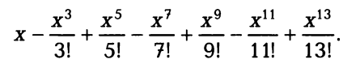

# Задания для самостоятельного выполнения

### task_05_01.cpp
Одноклеточная амеба каждые три часа делится на две клетки. Определить, сколько амеб будет через 3, 6 , 9, 12, ..., 3n часов. 
Процесс организовать с помощью функции **func_ameba(int n)** 
Функция  **func_ameba** принимает в качестве аргумента количество часов n и возвращает количество через 3n часов

### task_05_02.cpp
Составить программу для решения следующей задачи: сколько можно купить быков, коров и телят, платя за быка 10 р., за корову — 5 р., а за теленка — 0,5 р., если на 100 р. надо купить 100 голов скота?

### task_05_03.cpp
Напечатать таблицу умножения и сложения натуральных чисел в десятичной системе счисления.

### task_05_04.cpp
Ежемесячная стипендия студента составляет сумму А рублей, а расходы на проживание превышают стипендию и составляют сумму В рублей в месяц. Рост цен ежемесячно увеличивает расходы на 3 %. Рассчитать сумму, которую следует единовременно попросить у родителей, чтобы прожить учебный год (10 месяцев), используя только эти деньги и стипендию. 
Процесс организовать с помощью функции **func_summ(int A, int B)** 
Функция  **func_summ** принимает в качестве аргументов стипендию и расходы и возвращает сумму, которую необходимо попросить у родителей

### task_05_05.cpp
Дано действительное число x. Вычислить выражение:

### task_05_06.cpp
Вычислить n значений функции F(x) с шагом h, начиная с x=a представив результат в виде таблицы, первый столбец которой — значения аргумента, второй — соответствующие зна­чения функции:

F(x) = sinx - cosx

Результат выводить с 2-мя знаками после запятой.
