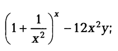

# Практическая работа "Функции"

## Задание №1 (ex_12_01.cpp)
Вычислить значение по следующим формулам при действительных значениях всех переменных  
Вычисление результата должно быть выполнено в функции **result**

## Задание №2 (ex_12_02.cpp)
Найти произведение цифр заданного четырехзначного числа. 
Вычисление результата должно быть выполнено в функции **calc_number**

## Задание №3 (ex_12_03.cpp)
Вычислить расстояние между двумя точками с заданными координатами (x1,y1) и (х2, у2). 
Вычисление расстояния должно быть выполнено в функции **point_distance**

## Задание №4 (ex_12_04.cpp)
Дана длина ребра куба. Найти площади грани, полной поверхности и объем этого куба. 
Вычисления должны быть выполнены в функциях: 
грань - **cub_edge**  
поверхность - **cub_surf**  
объем - **cub_vol**
