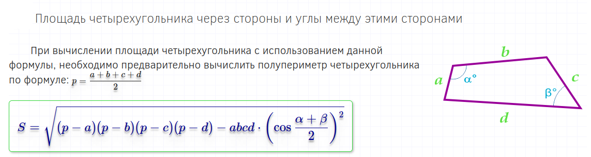

# Задания для самостоятельного выполнения

### task_12_01.cpp

Вычислить площадь правильного шестиугольника со стороной а, используя подпрограмму вычисления площади треугольника.
Решение выполнить с использованием функции square_triangle(int a)

### task_12_02.cpp

Длины сторон параллелограмма заданы числами X, Y, Z, Т. 
Вычислить его площадь, если угол между сторонами X и Y равен A(град), а между сторонами Z и T B(град.) 
Вычисление площади оформить в виде фунции square_ quadr 
**Спецификация функции square_ quadr **
Вход - целочисленные длины сторон и углы (град) между ними square_ quadr(int X,int Y, int A,int Z,int T, int B) 
Выход - вещественное значение площади  
Примечание - математическая модель приведена на рис. task_12_02.png. Перед использованием тригонометрических функций градусную меру угла необходимо перевести в радианы 

**рис. task_12_02.png**

### task_12_03.cpp

Дано простое число. Составить функцию find_simple_number, которая будет находить следующее за ним простое число. 
Спецификация **find_simple_number**: 
Вход - целое простое число N 
Выход - следующее простое число 

### task_12_04.cpp

Из заданного числа вычесть сумму его цифр. Из полученного результата также вычесть сумму его цифр и т.д.  
Определить,сколько требуется выполнить таких действий, чтобы получить нуль. 
Вычитание суммы цифр из числа оформить в виде функции **subtr_summ(int n)** 

### task_12_05.cpp

Дана символьная строка, представляющая собой запись натурального числа в p-ричной системе счисления (2 < р < 9).  
Перевести это число в десятичную систему счисления. 
Перевод выполнять с помощью функции **change_num (string num, int p,int d)** 

Спецификация функции: 
-----------------------
* Вход - исходное число в виде строки, исходная система счисления, длина строки (string num, int p,int d) 
* Выход - целое число в десятичной системе счисления 

### task_12_06.cpp

Имеется часть катушки с автобусными билетами. Номер билета шестизначный. Определить количество счастливых билетов на катушке, если меньший номер билета — N, а больший — М.
(Билет является счастливым, если сумма трех первых его цифр равна сумме трех последних цифр.)
Процесс организовать с использованием функции happy_ticket

Спецификация функции happy_ticket
---------------------------------
Вход - целочисленные значения наименьшего и наибольшего номеров на катушке - (int N, int M)  
Выход - количество счастливых билетов на катушке 

## ТЕСТИРОВАНИЕ 
После написания, проверки и отладки программы необходимо выполнить тестирование программного кода. Для это цели для каждого задания **task_** в каталоге имеется файл **test_**. Например, для task_12_01.cpp - test_12_01.cpp 

1) Установить фреймворк для написания (использования) модульных тестов  

На Ubuntu: 
**sudo apt-get install libgtest-dev**

2) В каталоге **home** установить полные права на запуск программы  **testhomework**  

**sudo chmod 777 testhomework**

3) Для выполнения тестирования необходимо запустить программу **testhomework** с аргументом **-a**, если выполняется пакетное тестирование всех программ или указать имя файл-теста **test_12_01.cpp**, если тестируется только один файл. Например: 

Все задания: 
**./testhomework -a**

или одно задание **task_12_01.cpp**

**./testhomework test_12_01.cpp**

Результаты тестирования:  
**PASSED** - успешно 
**FAILED** - тест провален 

Файлы, прошедшие тестирование автоматически отправляются на github.com с необходимым commit-ом 
Для просмотра ошибок в командной строке необходимо ввести команду:  
**./test_12_01.out**

**Рисунок 12**

В данном примере показано, что тестируется функция **square_triangle(3)** (рис. 12, 1) которой передается значение 3 
Ожидается ответ **3.897** (рис. 12, 2) 
Получен ответ (which is) **0** (рис. 12, 3) 
Данный тест запускается дважды с разными значениями

  > Подделывать результаты тестов не имеет смысла, так как программный код проверяется на стороне преподавателя
  
  > Изучение работы unit-тестов приветствуется
